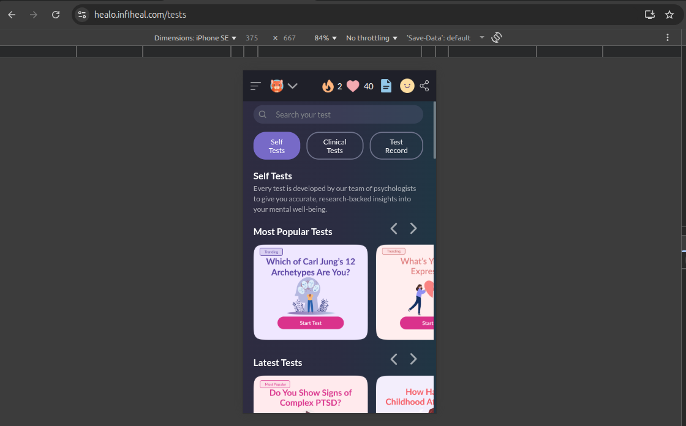

# UI/UX & Cross-Browser Audit Report

## Testing Matrix
| Browser  | 360×640 (Mobile) | 768×1024 (Tablet) | 1366×768 (Desktop) | 1920×1080 (Desktop) |
|----------|------------------|-------------------|--------------------|---------------------|
| Chrome   | ✅               | ✅                | ✅                 | ✅                  |
| Firefox  | ✅               | ✅                | ✅                 | ✅                  |

---

## Issue Log

| ID | Page / Component | Environment (Browser / Size) | Severity | Description | Screenshot | Root Cause (suspected) | Proposed Fix (snippet/approach) |
|----|------------------|------------------------------|----------|-------------|------------|-------------------------|---------------------------------|
| 1  | Signup (Anonymous → Create Username) | Chrome / 1366×768 | High | On submit, backend returns "Username already exists" toast, but modal copy says you've created an account and prompts to log in. Conflicting messages confuse the user. |  | Error mapping/UI copy not aligned with API error; generic success-ish modal shown for all 4xx. | Show inline error in the modal: "Username already exists. Try a different one." Keep modal open, focus the username input. Add aria-live for error. |
| 2  | Signup (Anonymous → Create Username) | Chrome / 1366×768 | Medium | Popup closes immediately after error; user loses context and typed data. |  | Modal auto-close on error or global toast handler dismisses modal. | Prevent auto-close on non-2xx. Persist form state; require explicit user action to dismiss. |
| 3  | Tests Listing (Mobile) | Chrome DevTools iPhone SE / 375×667 | Low | Right edge has no inner padding while left edge has spacing; cards and chevrons touch the viewport edge. |  | Asymmetric container padding or overflow from horizontal carousel. | Standardize horizontal padding using CSS logical props; ensure carousels respect container padding. |
| 4  | Journal Page — Tabs (Focus Zone/Today’s Journal/Record/Date Range) | Chrome DevTools iPad Mini / 768×1024 | Medium | Tabs crowd, truncate, and the active pill gets clipped; tap targets feel small and there’s no horizontal scroll affordance. |  | Tabs container uses fixed width with no `overflow-x`; items lack min touch size and focus-visible styles. | Make tabs horizontally scrollable with padding and gap; enforce 44px min tap height; add focus-visible ring and ARIA `role="tablist"` semantics. |
| 5  | Side Menu (Global Navigation) | Chrome DevTools / iPhone SE (375×667) | Medium | Side menu spacing, alignment, and icon consistency are off. Example: uneven padding between sections, some menu items have icons while others don’t, and button styles (“Explore Premium” vs “SOS Helpline”) are inconsistent. |  | Inconsistent design system usage; missing standard component spacing and icon guidelines. | Adopt consistent padding, ensure all actionable items use icons or none, and unify CTA button styles. Use a design token for menu item spacing/typography. |
| 6  | Tests Page — Tabs (Self / Clinical / Record) | Chrome DevTools iPhone SE / 375×667 | Medium | When on **Self Tests**, tabs show in a single row (3 side by side). But switching to **Clinical Tests**, the tab layout breaks into wrapping rows instead of maintaining consistent inline layout. |   | Inconsistent tab container width or flex wrapping; missing responsive handling for tab items. | Keep tabs in a horizontal flex container with `overflow-x: auto`; prevent wrapping by using `white-space: nowrap` or `flex-wrap: nowrap`. |

---

## Top 2 Fixes (Prioritized)

1. **Anonymous Signup → Create Username – Inline error handling**  
   Ensure that when the username already exists, the modal displays an inline error message ("Username already exists. Try a different one.") instead of showing a misleading success modal.  

2. **Anonymous Signup → Create Username – Prevent auto-close on error**  
   Stop the modal from closing automatically when an error occurs. Preserve the entered username and keep the form in context until the user explicitly dismisses or corrects it. 
